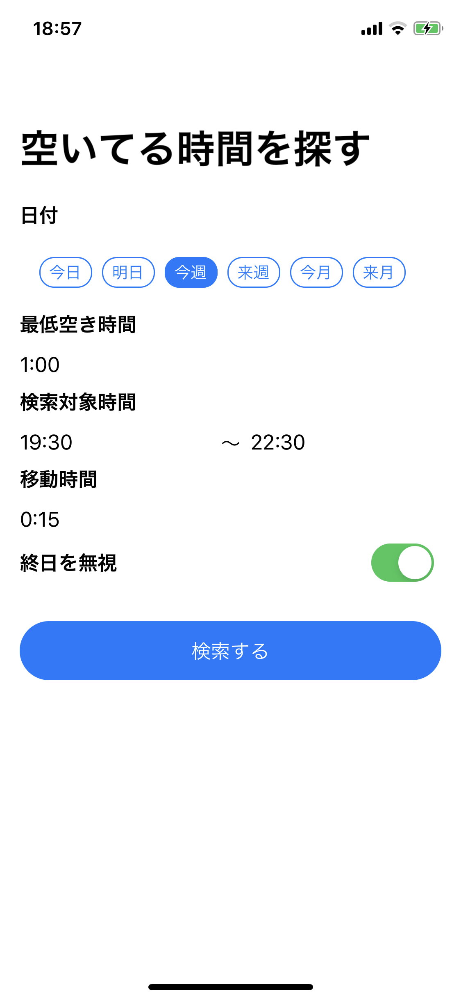

#  Free time picker iOS application.

This is iOS application for search free time in your calendar.

[](https://app.bitrise.io/app/1e5ee18b31a8c2b1)

Search | Detail
-------|--------
 | 

## Environment

- macOS Catalina 10.15.3（19D76）
- Xcode Version 11.3.1 (11C504)

## Ready

### Firebase

```sh
cp $YOUR_GOOGLE_SERVICE_INFO_PLIST FreeTimePicker/Resources/GoogleService-Info.plist
```

### AdMob

```sh
cp FreeTimePicker/Config/Config-Debug.xcconfig.sample FreeTimePicker/Config/Config-Debug.xcconfig
cp FreeTimePicker/Config/Config-Release.xcconfig.sample FreeTimePicker/Config/Config-Release.xcconfig
```

and replace `[YOUR_ADMOB_APP_ID]` to your AdMob App ID and replace `[YOUR_ADMOB_UNIT_ID]` to your AdMob unit ID in xcconfig.

## Using

EventKit, SwiftUI, Combine, Intents Extension
